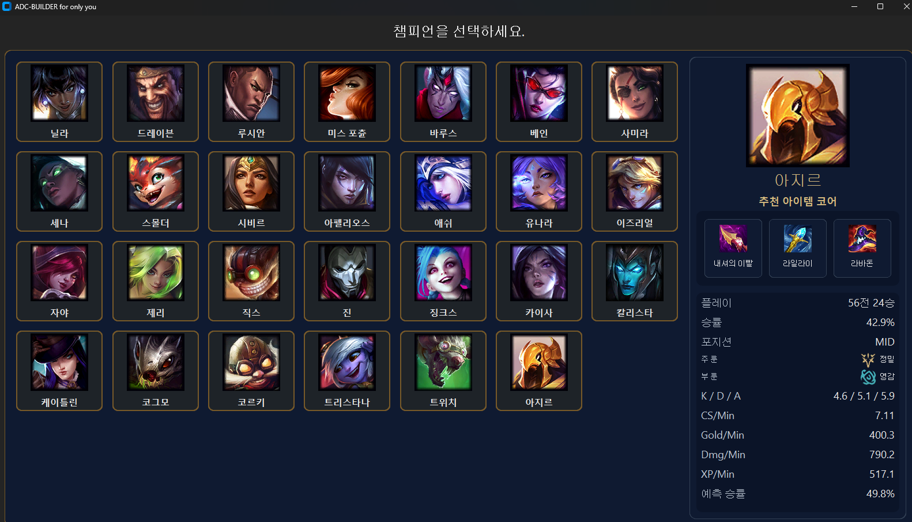

# 오픈 소스 프로그래밍 #
# ⚙️ LoL ADC Build Helper ⚙️
**LoL ADC Build Helper**는 리그 오브 레전드(League of Legends)에서 **원딜(ADC)** 유저를 위한  **통계 + 승률 예측** 도구입니다.  



Riot Games의 **Data Dragon API**와 **Riot Match API**를 활용하여 개인 경기 데이터를 분석하고, 파이선(`python`)과 머신러닝 모델(`scikit-learn`)을 통해 각 챔피언별  **통계**와 **예측 승률**를 제공합니다.

## 주요 기능

- **GUI 기반** (`CustomTkinter`) — 챔피언 클릭으로 자동 통계/예측 표시
- **머신러닝 예측** — `RandomForestClassifier`로 개인 경기 기반 승률 예측
- **챔피언 최빈 코어 아이템 3개 자동 분석**
- **KDA, CS, Gold/Min, Dmg/Min, XP/Min 등 주요 지표**
- **룬, 패치 버전, 포지션 자동 인식 및 표시**
- **Riot API 자동 데이터 수집 (시즌별 경기)**

## 설치 및 실행

### 1️. 사전 준비
Python과 pip 환경이 필요합니다.

### 2️. Riot API 키 설정  
프로젝트 루트에 `secret_config.py` 파일을 생성하고 다음 내용을 입력하세요:

```python
import requests

RIOT_API_KEY = "YOUR_API_KEY"
RIOT_ID = "소환사이름#KR1"
MY_SUMMONER_NAME = "소환사이름"

def split_riot_id(riot_id: str):
    if "#" not in riot_id:
        raise ValueError("형식은 Name#Tag 여야 합니다.")
    return riot_id.split("#", 1)

name, tag = split_riot_id(RIOT_ID)

def get_puuid(name: str, tag: str):
    url = f"https://asia.api.riotgames.com/riot/account/v1/accounts/by-riot-id/{name}/{tag}"
    HEADERS = {"X-Riot-Token": RIOT_API_KEY}
    return requests.get(url, headers=HEADERS).json()["puuid"]

MY_PUUID = get_puuid(name, tag)
```

> ⚠️ API 키는 절대 GitHub에 올리지 마세요!  
> `.gitignore`에 이미 `secret_config.py`가 포함되어 있습니다.

---

## 데이터 수집 & 모델 학습

1. **경기 데이터 수집**
```bash
python load_my_matches.py
```
→ `data/my_matches_raw.jsonl` 생성

2. **CSV 전처리 생성**
```bash
python build_my_stats.py
```
→ `data/my_matches_ml.csv` 생성

3. **모델 학습**
```bash
python analyze_my_winrate.py --train
```
→ `data/my_win_model.joblib` 생성

---

## 이미지 생성

```bash
python mkimg.py
```
→ `data/images` 생성 

---

## GUI 실행

```bash
python lol-adc-builder-helper.py
```

GUI가 실행되면 챔피언 목록이 표시됩니다.  
클릭 시 개인 평균 통계, 최빈 코어 아이템, 예측 승률이 자동 표시됩니다.

---

## 📂 폴더 구조

```
lol-adc-build-helper/
├── lol-adc-builder-helper.py   # GUI 메인
├── analyze_my_winrate.py       # 모델 학습/예측
├── build_my_stats.py           # CSV 전처리
├── load_my_matches.py          # Riot API 데이터 수집
├── mkimg.py                    # 챔피언/룬 이미지 다운로드
├── secret_config.py            # API 키 / PUUID 설정
├── data/                       # 저장된 데이터
└── images/                     # 챔피언, 룬 아이콘
```

## 📱 사용 기술

| 분류 | 기술 |
|------|------|
| 언어 | Python 3.12 |
| 데이터 | pandas, requests, joblib |
| 머신러닝 | scikit-learn (RandomForestClassifier) |
| GUI | CustomTkinter, PIL |
| API | Riot API, Data Dragon |
| 기타 | tqdm, argparse, collections |

---

## 🧑‍💻 개발자 정보

- **이름:** thisaccountisdiff  
- **학교:** 서울과학기술대학교 컴퓨터공학과  
- **프로젝트 목적:** 개인 경기 데이터 기반 원딜 빌드 및 승률 예측 자동화  
- **GitHub:** [https://github.com/papa-drodr](https://github.com/papa-drodr/lol-adc-build-helper)

---

## 🆗 라이선스

본 프로젝트는 **Riot Games API 정책**을 준수합니다.  
Riot Games는 본 프로젝트를 후원, 승인 또는 보증하지 않습니다.

---

## ❗주의사항❗

현재 프로젝트는 **상대 경로**를 사용하고 있습니다.
IDE를 이용하여 폴더를 열고 상대 경로를 이용해 **lol-adc-builder-helper.py**를 실행하세요.

---

###  ✅ TODO
- [ ] 실행 파일 제작(경로 수정)
- [ ] 빌드별 승률 비교
- [ ] 최근 패치 자동 반영
- [ ] 전체 챔피언 대비 통계
- [ ] 다음 시즌 대격변 패치